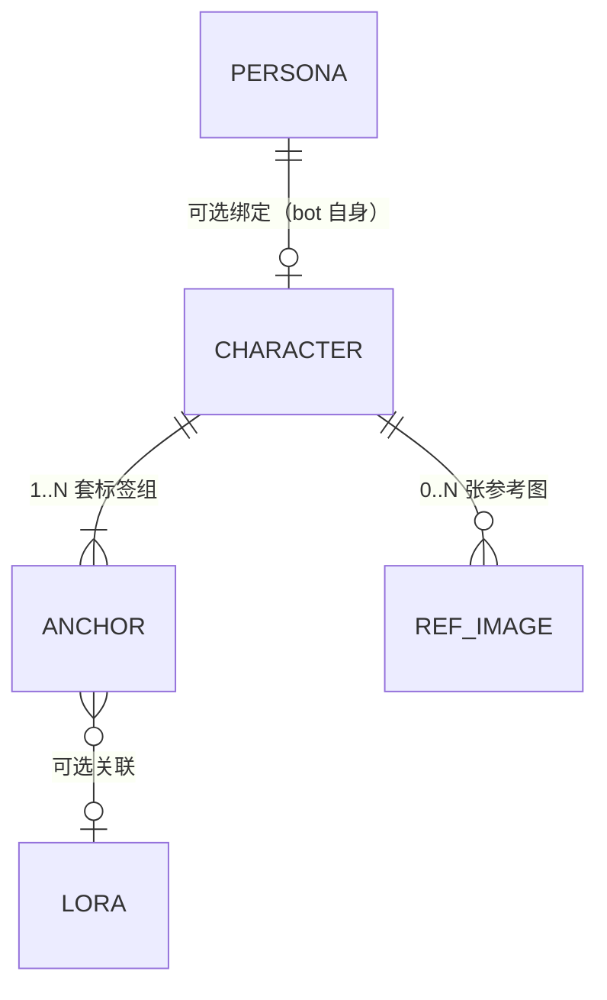

# 角色卡片（Character Card）设计文档

> 状态：**M1 + M2 + M3 已实现（v5.16.0 / v5.16.1 / v5.17.0 / v5.18.0）**
> 提出日期：2026-09-16
> 来源：用户需求「画一张你和薄荷的合照」中「你」= bot 人格角色，模型不检索绘画锚点，凭空造形象
> 关联：`comfyui_draw` docstring 的「角色一致性」「bot 自身入画」「多人分组」规则（v5.13.8~v5.14.3 已建立但只靠模型自觉）

### M1 落地情况（v5.16.0；v5.16.1 热修）

| 文档章节 | 落地位置 |
| --- | --- |
| 三、数据模型 | `character_store.py`（`data_dir/character.db`：`characters` / `character_anchors` / `character_refs`） |
| 四、检索与注入 | `character.py:inject()`（单角色追加；多角色计数标签 + 每角色 `(标签:权重)` 分组并剥掉模型自带分组） |
| 五、对话式设定 | `comfyui_character` 工具（M3 后共 14 个 action）+ `/角色` 指令（add/set/use/del/删…） |
| 五.3 人格解析 | `character.py:resolve_persona_name()`（`persona_manager.resolve_selected_persona` → `get_default_persona_v3`） |
| 七、仓库硬约束 | 已同步 `build_zip.ps1` 的 `$includeList` 与 `main.py` 的 `importlib.reload` 列表 |
| 八、配置项 | `_conf_schema.json` 的 `character_card` 块 + `ConfigView.vue` 新增「角色卡片」分区 |
| 注入接入点 | `_do_draw`（覆盖 AI 对话 / 指令 / 伴侣插件全部入口；`_fixed_prompt` 跳过） |
| 测试 | `tests/test_character.py`（M1 时 35 项，M3/审计后 58 项；含 v5.16.1「你和」语序防回归） |

实测修正（相对本文档初稿）：多人分组内部**不写**计数标签（计数只由全局那一个表达）；
画质前缀必须置顶；`allow_web_fetch` 仅预留（M3 未实现）。

### M2 落地情况（v5.17.0）

| 文档章节 | 落地位置 |
| --- | --- |
| 六、WebUI 双通道 | `webui_api.py` 9 个 handler + `routes` 注册；`standalone_webui.py` 的 `_dispatch` 加 `/character/*` 分支与 `_api_character()` 适配器（复用同一批 handler） |
| 六、前端 | `webui-src/src/views/CharacterView.vue`（列表/搜索/新建/详情抽屉/锚点增删改+设主/导出导入） |
| 六、路由与导航 | `router/index.ts` + **两处导航**：`App.vue` 的 PC 侧栏 menuOptions、`router/nav.ts` 的 NAV_ITEMS（移动端） |
| 测试 | `tests/test_character_webui.py`（30 项，桩掉 `astrbot.api.web` 直调 handler，含路由注册自检） |

M2 期间由测试暴露并修正：`character_anchor_save` 编辑路径不该强制 `character_id`
（新增 `CharacterStore.get_anchor_by_id()`）。

### M3 落地情况（v5.18.0）

| 文档章节 | 落地位置 |
| --- | --- |
| 九、图片落地 | `character_store.py`：`characters_dir/refs_dir/store_ref_bytes/store_ref_from_path`（内容寻址 `<sha16>.<ext>`，同角色同图去重；删角色连带清目录） |
| 九、NSFW 打标 | `character.py:land_ref()`（复用 `nsfw_detector` + 图库阈值，检测不可用记 -1 不阻断） |
| 九、联网补全（来源优先级） | `character.py:suggest_anchor()` 走**已有 danbooru 标签服务**（不抓官网）；返回候选，**人工确认后**才落库 |
| 九、通用网页搜索 | 核实 AstrBot 4.28.1 有 `web_search_*` 系列工具（插件不可直接调）→ docstring 引导模型自行联网查资料、整理标签，用户确认后落库 |
| 九、参考图用途 | ① WebUI 展示（缩略图/NSFW/来源）；② 图生图：`list_refs` 返回本地路径，可作 `comfyui_draw` 的 `image`（**按文档不做自动图生图**，保持人工触发） |
| 入口 | `/角色 参考图 列表\|记住\|删`、`/角色 补全 <角色>`；`comfyui_character` 的 `list_refs/add_ref/delete_ref/suggest` |
| 六、WebUI 双通道 | 5 个新 handler（`ref/upload|image|delete|from_gallery`、`suggest`）+ 独立通道分派；前端参考图区块与补全弹窗 |
| 测试 | `tests/test_character.py` 46 项、`tests/test_character_webui.py` 47 项 |

`allow_web_fetch` 语义已对齐实现：只约束 **http(s) 直链落图**；danbooru 标签服务是本机/自建链路，不受它限制。

---

## 一、需求概述

为「具体角色」建立**可持久化、可维护、可经对话设定**的绘图资料库，让"这个角色长什么样"从**模型的即兴发挥**变成**插件的确定性注入**。

五条核心诉求：

1. **多人格**：系统存在多个 bot 人格（如 `小叽V4`、`霜岛绫V4`）。用户说「画你」时指的是**当前会话生效的人格**，其形象必须能被查到。
2. **一个角色多个锚点**：一个角色有多套提示词标签组（默认装 / 泳装 / 校服 / 季节限定…），绘图时按用户要求选用；未指定则用**主锚点**。
3. **对话可设定**：「记住小叽的样子是…」「小叽换成蓝发」「给薄荷加一套泳装锚点」——角色与锚点都能**通过对话**新增/修改，无需开 WebUI。
4. **持久化与可修正**：设定落库，后续每张图复用；用户发现对不上（如发色错了）能立刻改，下一张图即生效。
5. **确定性注入**：卡片命中时由**插件**把锚点标签（含多人分组、计数标签）写进提示词，不再依赖模型是否听话。

原文档里的「联网找角色 + 下载参考图」保留，但**降级为第三阶段的可选增强**（详见第九节）。

---

## 二、概念模型

| 概念 | 说明 | 对应 AstrBot 概念 |
| --- | --- | --- |
| **人格 persona** | bot 扮演的角色，会话级生效。id 即 `Personality["name"]`（如 `小叽V4`） | `context.persona_manager.personas_v3` |
| **角色卡 character** | 一个可绘图角色。来源三类：**bot 自身人格角色**、用户原创角色、第三方 IP 角色 | 本插件 `character.db` |
| **锚点 anchor** | 角色的一套**提示词标签组**（正标签串 + 负标签串 + 建议权重 + 可选关联 LoRA + 备注）。一个角色 N 个（N≥1） | 同库 `character_anchors` |
| **参考图 ref** | 0~N 张参考图，用于卡片展示与图生图 | `data_dir/characters/<slug>/` |
| **主锚点 primary** | 未指定锚点时默认使用的那一套（每个角色恰有 1 个） | `character.is_primary_anchor_id` |



关键点：

- **persona ↔ character 是可选的 1:1 绑定**（`character.persona_name` 非空即绑定）。第三方角色（薄荷）不绑人格；bot 自身角色（小叽）绑定人格，从而「画你」可解析。
- **锚点是绘图的实际载体**。角色卡只存身份信息；所有进提示词的东西都在锚点里。

---

## 三、数据模型

新增 `character_store.py`，数据文件 `data_dir/character.db`（沿用现有 store 范式：WAL + `CREATE TABLE IF NOT EXISTS` + 缺列 `ALTER TABLE` 迁移，无 schema 版本号；参考 `quota_store.py:40-100`）。

```sql
CREATE TABLE IF NOT EXISTS characters (
    id            INTEGER PRIMARY KEY AUTOINCREMENT,
    name          TEXT NOT NULL,                 -- 角色名（唯一键，大小写不敏感比较）
    aliases       TEXT DEFAULT '[]',             -- JSON 数组：别名/昵称（「你」「我」「小叽酱」）
    persona_name  TEXT DEFAULT '',               -- 绑定人格名；空=未绑定（第三方角色）
    work          TEXT DEFAULT '',               -- 作品/IP（如 Neverness to Everness）
    lora_name     TEXT DEFAULT '',               -- 可选：关联 LoRA 名（绘图时自动启用）
    primary_anchor_id INTEGER DEFAULT 0,         -- 主锚点 id
    source        TEXT DEFAULT 'user',           -- user / persona / web / import
    note          TEXT DEFAULT '',
    enabled       INTEGER NOT NULL DEFAULT 1,
    created_at    REAL NOT NULL DEFAULT 0,
    updated_at    REAL NOT NULL DEFAULT 0
);

CREATE TABLE IF NOT EXISTS character_anchors (
    id           INTEGER PRIMARY KEY AUTOINCREMENT,
    character_id INTEGER NOT NULL,
    name         TEXT NOT NULL,                  -- 锚点名：默认装/泳装/校服/冬季…
    kind         TEXT DEFAULT 'outfit',          -- appearance / outfit / full（full=含外观+服装）
    positive     TEXT NOT NULL,                  -- 正标签串（danbooru 英文标签，逗号分隔）
    negative     TEXT DEFAULT '',
    weight       REAL NOT NULL DEFAULT 1.2,      -- 多人分组时的建议权重
    lora_name    TEXT DEFAULT '',                -- 该锚点可覆盖角色级 LoRA
    skip_trigger_words INTEGER NOT NULL DEFAULT 1, -- 锚点已含身份词时不再全局追加该 LoRA 触发词
    note         TEXT DEFAULT '',
    sort_order   INTEGER NOT NULL DEFAULT 0,
    created_at   REAL NOT NULL DEFAULT 0,
    updated_at   REAL NOT NULL DEFAULT 0
);

CREATE TABLE IF NOT EXISTS character_refs (
    id           INTEGER PRIMARY KEY AUTOINCREMENT,
    character_id INTEGER NOT NULL,
    path         TEXT NOT NULL,                  -- data_dir/characters/<slug>/<sha16>.<ext>
    url          TEXT DEFAULT '',                -- 来源链接（联网抓取时）
    sha256       TEXT DEFAULT '',
    nsfw_score   REAL DEFAULT -1,                -- 复用 nsfw_detector；-1=未检测
    note         TEXT DEFAULT '',
    created_at   REAL NOT NULL DEFAULT 0
);
CREATE INDEX IF NOT EXISTS idx_anchor_char ON character_anchors(character_id);
CREATE INDEX IF NOT EXISTS idx_ref_char    ON character_refs(character_id);
```

Store 方法（命名对齐现有 store 风格）：

```
create_character / update_character / delete_character / get_character(name_or_id, fuzzy=True)
list_characters(keyword="") / find_by_persona(persona_name) / resolve(text) -> (character, anchor)
  ↑ resolve：输入用户话里的名字（含别名/「你」）返回角色与命中锚点
list_anchors(char_id) / add_anchor / update_anchor / delete_anchor / set_primary_anchor
add_ref / list_refs / delete_ref
export_all / import_all            # 备份迁移用
```

---

## 四、检索与注入（本文档的核心）

### 4.1 优先级（**修正原文档的「第四步兜底」**）

画一个具体角色时的解析顺序：

```
① 角色卡片（用户自己确认过的权威设定，含锚点标签 / 关联 LoRA / 负向）
② 角色 LoRA（库里查到的角色 LoRA + 触发词）
③ danbooru MCP / 标签服务
④ 模型自身知识
⑤ 联网检索兜底（阶段三；命中后建议"记住"成卡片，回到 ①）
```

理由：卡片是**人工确认过**的，且能一次锁定外观+服装+权重+分组；LoRA 与 danbooru 都是它的补充或降级来源。

### 4.2 注入时机与渲染规则

在 `comfyui_draw` / `_do_draw` 入口做**角色解析**（静默、确定性），命中卡片则渲染：

| 场景 | 渲染结果 |
| --- | --- |
| 单角色（「画小叽」） | `锚点.positive` 直接并入正向提示词（追加而非替换，保留用户的动作/场景描述） |
| 单角色 + 「画你」 | 先解析**当前会话人格** → 查 `persona_name == 人格名` 的卡片 → 同上 |
| 多角色（「鉴定师和薄荷站一起」） | 计数标签自动补（角色数 → `2girls`/`1boy 1girl`） + 每角色一个分组 `(锚点.positive:锚点.weight)`；卡片顺序 = 提及顺序 |
| 锚点关联 LoRA | 自动并入 `loras` 参数；`skip_trigger_words=1` 时该 LoRA 触发词不再全局追加（防串味，与 v5.14.0 的多角色抑制规则一致） |
| 用户指定锚点（「薄荷泳装」「用校服那套」） | 命中锚点名则用该锚点，否则用主锚点 |

**必须**：渲染结果写日志（`【角色卡】 命中 角色=薄荷 锚点=默认装 注入=...`），否则出问题无法排查。

### 4.3 与现有规则的关系

- **v5.13.8 角色一致性**：卡片命中后，跨轮一致性由数据库保证，不再依赖「模型逐字沿用」。
- **v5.14.0 多角色拦截**：卡片路径**不触发**该拦截（插件自己就会渲染分组）；仅当模型自行写多角色 LoRA 且无卡片时仍拦截。
- **v5.14.3 bot 自身入画**：由「让模型去记忆库检索」升级为「插件按人格直接查卡片」；docstring 仍保留兜底检索（卡片缺失时）。

---

## 五、对话式设定（阶段一重点）

### 5.1 LLM 工具 `comfyui_character`

| action | 参数 | 用户话术示例 |
| --- | --- | --- |
| `list` | keyword | 「都有哪些角色卡」 |
| `get` | name | 「小叽的设定是什么」 |
| `save` | name/aliases/work/persona_name/lora_name/anchor_* | 「记住小叽的样子：白发、异色瞳、猫耳…」 → 建卡 + 建主锚点 |
| `update` | name + 字段 | 「小叽绑定的 LoRA 是 XX」 |
| `delete` | name | 「删掉小叽的卡片」（需用户确认） |
| `add_anchor` | name + anchor 字段 | 「给薄荷加一套泳装：…」 |
| `update_anchor` | name + anchor_name + 字段 | 「小叽的默认装改成蓝发」 |
| `delete_anchor` | name + anchor_name | 「删掉校服那套」 |
| `set_primary_anchor` | name + anchor_name | 「小叽默认用泳装那套」 |
| `bind_persona` | name + persona_name | 「把这张卡绑到小叽V4人格」 |

docstring 要点：**静默调用**；写入前回显摘要（「已记住：小叽 / 默认装 / 白发、异色瞳…」）；删除前必须让用户二次确认；参数名进入 `tests/test_llm_tool_docstrings.py` 的 `REQUIRED`。

### 5.2 指令入口 `/角色`（等价、更可靠）

```
/角色                     列表
/角色 看 小叽              查看卡片与全部锚点
/角色 记住 小叽 白发异色瞳猫耳  [--别名 小叽酱 --作品 NTE --人格 小叽V4]
/角色 改 小叽 锚点=默认装 +标签 blue_hair   （或 --set 覆盖）
/角色 锚点 add 薄荷 泳装 "…标签…"
/角色 锚点 use 小叽 泳装     （设为主锚点）
/角色 删 小叽               （需二次确认）
```

指令优于 LLM 的部分：不受模型听话程度影响、管理员可用、支持精确字段。两条入口共用同一份 store 逻辑。

### 5.3 人格解析（已核对 AstrBot 4.27.4 源码）

```python
pm = getattr(self.context, "persona_manager", None)          # astrbot/core/star/context.py:161
umo = getattr(event, "unified_msg_origin", "") or ""
persona = await pm.get_default_persona_v3(umo=umo)           # persona_mgr.py:68
# 更精确（会读会话级强制人格 session_service_config.persona_id）：
pid, persona, forced, _ = await pm.resolve_selected_persona(
    umo=umo, conversation_persona_id=None,
    platform_name=event.get_platform_name(), provider_settings=None,
)                                                             # persona_mgr.py:83
name = (persona or {}).get("name", "")                        # personas_v3 的 name 即 persona_id
```

注意：`Personality` 是 dict-like，`name` 就是 persona_id（`persona_mgr.py:52-66`）。全部用 `getattr`/`try` 容错，取不到时降级为「未绑定人格，走原链路」。

---

## 六、WebUI（双通道，务必两处都改）

| 步骤 | 文件 | 说明 |
| --- | --- | --- |
| 1 | `webui_api.py` | `WebUIApi` 内新增 `character_list / character_get / character_save / character_delete / character_anchor_*`，返回 `json_response` / `error_response` |
| 2 | `webui_api.py` | `routes` 列表（约 2038 行）加 `(f"{prefix}/character/list", _h("character_list"), ["GET"], "...")` 等 |
| 3 | `standalone_webui.py` | `_dispatch`（约 504 行）加分支 `/character/*` → `_api_character`，**照抄 `_api_story`（453-502）的 `_AioReqAdapter` + `_request_lock` 适配器写法**即可复用第 1 步的 handler（用户主力用独立 WebUI，这步不能漏） |
| 4 | `webui-src/src/router/index.ts` | 加路由（hash 路由，静态 import） |
| 5 | `webui-src/src/router/nav.ts` | `NAV_ITEMS` 加导航项（PC 侧栏与移动抽屉共用） |
| 6 | `webui-src/src/views/CharacterView.vue` | 新建；**以 `StoryView.vue` 为 CRUD 样板**（`apiGet("story/sessions")` 那套），列表 + 详情 + 锚点表格 + 编辑表单 + 删/存 |

约束与提醒：

- **本仓库没有 i18n 体系**（无 vue-i18n，文案硬编码中文，`App.vue` 只设了 Naive UI 的 `zhCN` 面板语言）。不要照搬工作区其它插件的「4 语言」要求。
- 权限：复用现有 `permissions` / `allow_draw_users` 判定；写操作默认限管理员（`_is_admin(event)`），只读可放开。
- 新配置键若新增，必须同步 `ConfigView.vue` 的 `GROUP_META`（`93-109`），否则配置页显示在兜底的「其他」分区。

---

## 七、新模块与仓库硬约束（最易漏）

新增顶层模块 `character_store.py` 时，**四处必须同步**，否则功能静默失效：

1. `build_zip.ps1` 的 `$includeList`（显式白名单，不加则 zip 里没文件）；
2. `main.py` `__init__` 里的 `importlib.reload` 依赖模块列表（约 972-979 行，不加则热更后 `sys.modules` 仍是旧代码）；
3. 若新增 LLM 工具 → `tests/test_llm_tool_docstrings.py` 的 `REQUIRED`；
4. 若新增配置键 → `_conf_schema.json` + `ConfigView.vue` 的 `GROUP_META`。

store 实例化沿用现有写法（`main.py:884-957` 一带，`try/except` 失败降级为 `None` + warning）：

```python
self.character = CharacterStore(self.data_dir, cfg_provider=lambda: self.config.get("character_card", {}))
```

---

## 八、配置项（`_conf_schema.json` 新增顶层块 `character_card`）

| 键 | 默认 | 说明 |
| --- | --- | --- |
| `enabled` | true | 总开关 |
| `auto_bind_persona` | true | 「画你」时自动按当前会话人格查卡片 |
| `auto_inject` | true | 命中卡片时自动注入锚点标签（否则只在工具返回里提示模型） |
| `auto_group_multi` | true | 多角色时自动渲染 `(标签:权重)` 分组与计数标签 |
| `default_weight` | 1.2 | 分组权重默认值（1.1~1.3，不超 1.5） |
| `allow_user_edit` | true | 非管理员能否用 `/角色` 写入 |
| `allow_web_fetch` | false | 阶段三：允许联网补全角色资料 |

同步：`ConfigView.vue` 的 `GROUP_META` 新增「角色卡片」分区（或并入「特殊功能」）。

---

## 九、联网获取与参考图（阶段三，可选）

- **来源优先级**：danbooru MCP/标签服务（已有链路）> 用户手动粘贴 > 通用网页搜索（需先确认 AstrBot 是否向插件暴露搜索能力）。
- ⛔ **禁止抓 danbooru 官网/镜像**（403/限流，`comfyui_draw` docstring 已明令禁止）。
- **图片落地**：`data_dir/characters/<slug>/<sha256[:16]>.<ext>`（内容寻址，复用 `image_store.py` 的 `_path_for` 思路）；抓取后过一遍 `nsfw_detector` 打标，`nsfw_score` 存库。
- **参考图用途**：① WebUI 展示；② 图生图（用户说「照这张画」时作为 `init_images`）。落地前不做自动图生图。
- 联网结果一律 `source='web'`，并在 WebUI 标注来源与抓取时间，**人工确认后才作为正式锚点**（避免脏数据污染出图）。

---

## 十、验收清单

- [ ] `/角色 记住 小叽 …` 后，`character.db` 有卡 + 主锚点，`/角色 看 小叽` 可回读
- [ ] 「画你和薄荷的合照」：日志出现「命中 角色=小叽（人格绑定）」「命中 角色=薄荷」，最终 prompt 带 `2girls` 与两个 `(…:1.2)` 分组，且**没有**触发多角色拦截
- [ ] 多人时角色 LoRA 触发词未被全局追加（无串味）
- [ ] 「小叽的默认装改成蓝发」后，下一张图即生效（无需重启）
- [ ] 未建卡的角色仍走原链路（LoRA → danbooru → 知识），行为不回归
- [ ] WebUI：内嵌页与独立 WebUI **两边**的列表/新增/编辑/删除都可用
- [ ] 热更验证：新增 `character_store.py` 已进 `build_zip.ps1` 清单与 reload 列表（`tar -tf` 复核 zip 内含该文件）
- [ ] 多角色 + 卡片 + 用户自定义动作描述混写时，动作/场景词不被卡片覆盖
- [ ] 删除卡片需二次确认；非管理员按 `allow_user_edit` 受控

---

## 十一、推进顺序

**M1（最小可用，建议先做）——卡片 + 对话设定 + 单角色注入**

1. `character_store.py` + 三张表 + CRUD（含 `resolve` / `find_by_persona`）；
2. `/角色` 指令（管理员可用）；
3. `comfyui_character` LLM 工具；
4. `_do_draw` 注入：单角色命中卡片 → 用主锚点标签；「画你」→ 人格解析绑定；
5. 仓库四处同步 + 日志埋点。

**M2——多人渲染 + WebUI**

6. 多角色自动分组渲染 + 计数标签 + 与 v5.14.0 拦截逻辑打通；
7. `CharacterView.vue` + 双通道路由 + 权限；
8. `_conf_schema.json` 的 `character_card` 块 + `GROUP_META`。

**M3——联网与参考图（可选）**

9. 联网补全（来源校验 + 人工确认）+ 图片落地 + NSFW 打标 + 参考图用于图生图。

---

## 十二、待确认 / 未决项

1. **人格解析的会话级精度**：`resolve_selected_persona` 需要 `conversation_persona_id`（会话级人格切换）。M1 先用 `get_default_persona_v3(umo)`，是否要读 `session_service_config` 的强制人格由实测决定。
2. **「你」的多义性**：群聊里用户说「你」指 bot；但「画我和小叽」中的「我」是用户自己——是否需要「用户自身角色卡」（如群友头像/虚拟形象）？待定。
3. **卡片与 LoRA 的冲突策略**：锚点标签与 LoRA 触发词重复时以卡片为准（`skip_trigger_words`），但若卡片标签是自然语言（非 danbooru 标签系底模），是否要做底模适配？待定。
4. **卡片分享/导入导出**：是否支持导出 JSON 分享给其他用户（结合 `ShareView`）？
5. **多人格 ↔ 一角色的多对一**：一个角色卡能否被多个人格共用（如「通用女仆装角色」）？当前设计为 1:1，若需要改为映射表。
6. **联网搜索能力可用性**：需确认 AstrBot 是否为插件提供可调用的 web 搜索工具（否则 M3 只能手动粘贴）。
